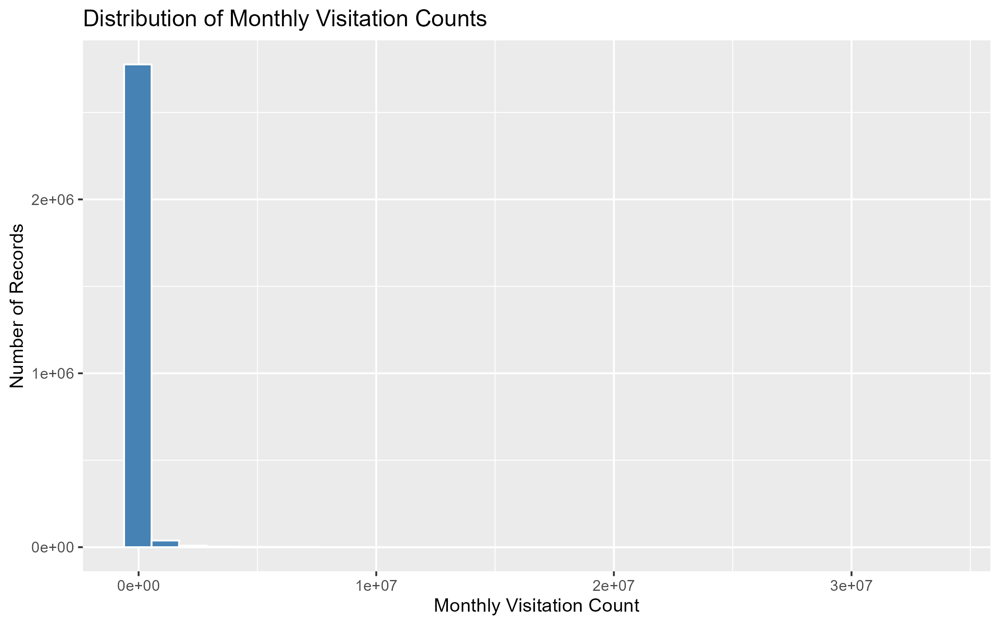
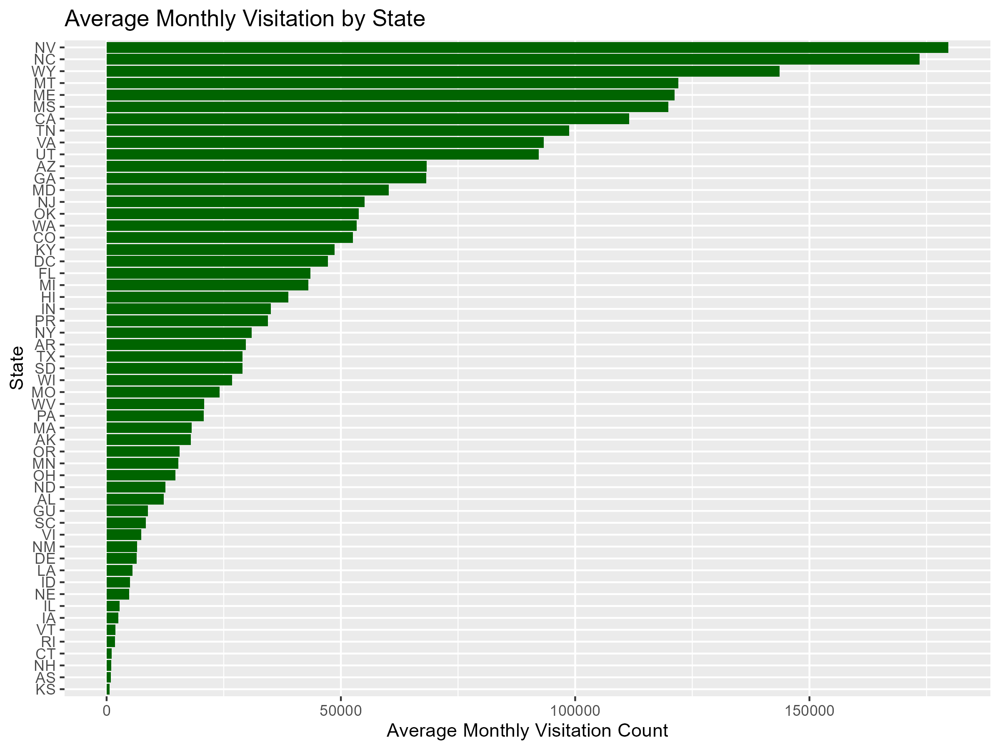
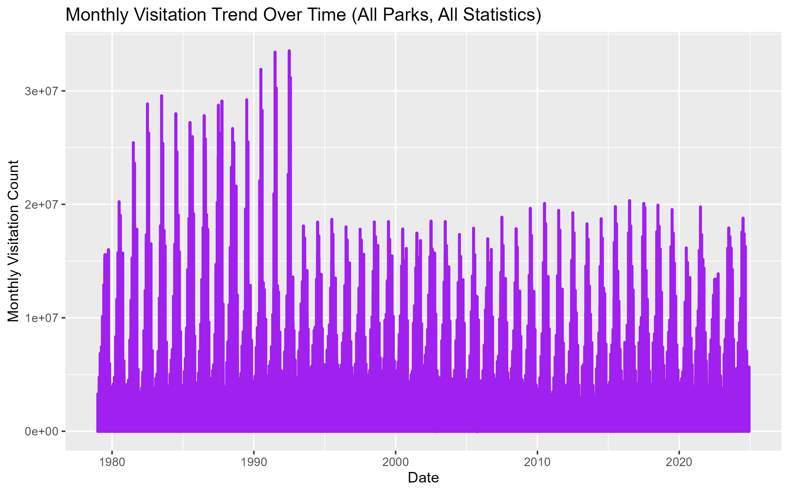
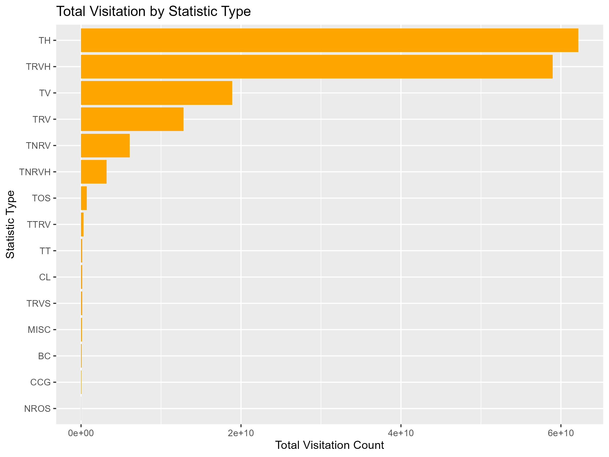

---

# 🌲 **National Park Service Visitation Analysis**

This project analyzes **National Park Service (NPS)** monthly visitation statistics using R.  
The dataset includes millions of records across multiple decades, covering recreation visits, non‑recreation visits, backcountry nights, concessioner lodging, trail use, vehicle hours, and more.

The goal is to understand **visitation patterns**, **state‑level differences**, **long‑term trends**, and **statistic‑specific behavior** across the entire NPS system.

---

## 📁 **Repository Structure**

```
Main data visualization/
│
├── data/
│   ├── Main_Data.csv
│   ├── Main_State_Data.csv
│
├── scripts/
│   └── analysis_R.R
│
├── visuals/
│   ├── histogram_monthly_visitation.png
│   ├── avg_monthly_visitation_by_state.png
│   ├── monthly_visitation_trend.png
│   └── total_visitation_by_statistic.png
│
└── README.md
```

---

## 📊 **Visualizations Included**

### **1. Distribution of Monthly Visitation Counts**

Shows how visitation numbers vary month‑to‑month across all parks and all statistic types.  
The distribution is highly skewed because many parks report zero backcountry nights, zero concessioner lodging, or zero trail counts in certain months.

---

### **2. Average Monthly Visitation by State**

Ranks states by average monthly visitation across all parks.  
Nevada leads due to **Lake Mead National Recreation Area**, one of the most visited units in the NPS system.

---

### **3. Monthly Visitation Trend Over Time**

Displays long‑term visitation trends across decades.  
Seasonal spikes represent summer peaks.  
Post‑1990 changes reflect shifts in reporting and park activity.

---

### **4. Total Visitation by Statistic Type**

Compares total visitation counts across all statistic categories.  
Total Hours (TH) and Total Recreation Vehicle Hours (TRVH) dominate due to their large measurement scale.

---

## 📘 **Data Dictionary**

A full data dictionary explaining each visitation statistic is included in `data_dictionary.md`.

### **Statistic Codes**

| Code | Meaning |
|------|---------|
| **TRV** | Total Recreation Visits — visitors entering for recreation. |
| **TNRV** | Total Non‑Recreation Visits — staff, contractors, deliveries. |
| **TV** | Total Visits — recreation + non‑recreation combined. |
| **TRVH** | Total Recreation Vehicle Hours — hours spent by recreation vehicles in the park. |
| **TH** | Total Hours — total visitor hours spent inside the park. |
| **CL** | Concessioner Lodging — overnight stays in concessioner‑run lodging. |
| **CCG** | Concessioner Campground — overnight stays in concessioner‑run campgrounds. |
| **TT** | Total Trail Use — trail counts (hikers, walkers, etc.). |
| **TRVS** | Total Recreation Visitor Stays — overnight stays by recreation visitors. |
| **TTRV** | Total Trailer/RV Visits — visits by RVs and trailers. |
| **BC** | Backcountry Overnight Stays — wilderness/backcountry camping. |
| **MISC** | Miscellaneous Use — special events, educational programs, boat launches, etc. |
| **NROS** | Non‑Recreation Overnight Stays — staff, researchers, contractors staying overnight. |
| **TOS** | Total Overnight Stays — all overnight stays combined. |
| **TNRVH** | Total Non‑Recreation Vehicle Hours — vehicle hours for non‑recreation use. |

---

## 🧰 **Tools Used**

- **R**
- **tidyverse**
- **ggplot2**
- **dplyr**
- **RStudio**

---

## 📈 **Dashboard Options**

This project can be extended into:

### **Power BI**
- State visitation map  
- Park‑level drill‑downs  
- Statistic‑specific filters  
- Seasonal trend visuals  

### **Tableau**
- Interactive heatmaps  
- Multi‑statistic comparison dashboards  
- Hover‑tooltips with definitions  

### **R Shiny**
- Dynamic filtering by park, state, statistic  
- Interactive ggplot visualizations  
- Time‑series exploration  

---

## 🧭 **Project Summary**

This project analyzes decades of National Park Service visitation data to uncover patterns in recreation use, overnight stays, vehicle hours, and trail activity across the United States. Using R and tidyverse, I cleaned, transformed, and visualized millions of monthly records from parks nationwide.

Key insights include:

- Nevada has the highest average monthly visitation due to Lake Mead NRA.  
- Visitation is highly seasonal, with sharp summer peaks visible across decades.  
- Total Hours (TH) and Recreation Vehicle Hours (TRVH) dominate total visitation metrics.  
- Many parks report zero backcountry nights or concessioner lodging, creating a heavily skewed distribution.

This project demonstrates skills in:

- Data cleaning and transformation  
- Exploratory data analysis  
- Visualization design  
- Interpretation of large‑scale public datasets  
- Communicating insights clearly and professionally  

---

## 👤 **Author**


**Data Analyst / Health Data Scientist**

[GitHub Profile](https://github.com/laar14)  
[LinkedIn Profile](https://www.linkedin.com/in/liyerpt/)


